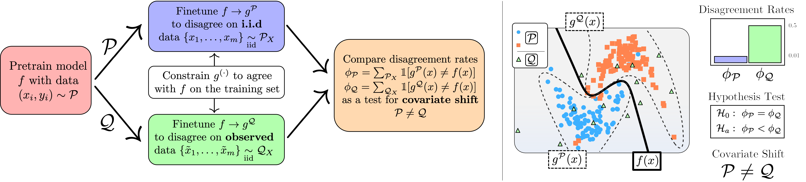

___
**Official implementation of the ICLR 2023 paper [A Learning Based Hypothesis Test for Harmful Covariate Shift
](https://arxiv.org/abs/2212.02742)**



## Setup

### Environment

`detectron` requires a working build of `pytorch` with the cudatoolkit enabled.
A simple environment setup using `conda` is provided below.

```shell
# create and activate conda environment using a python version >= 3.9
conda create -n detectron python=3.9
conda activate detectron

# install the latest stable release of pytorch (tested for >= 1.9.0)
conda install pytorch torchvision cudatoolkit=11.3 -c pytorch

# install additional dependencies with pip
pip install -r requirements.txt
```

### Datasets

We provide a simple config system to store dataset path mappings in the file `detectron/config.yml`

```yaml
datasets:
  default: /datasets
  cifar10_1: /datasets/cifar-10-1
  camelyon17: /datasets/camelyon17
```

for more information on downloading datasets see `detectron/data/sample_data/README.md`.

### Running Detectron

There is work in progress to package Detectron in a robust and easy to deploy system.
For now, all the code needed to reproduce our experiments is in located in the `experiments` directory
and can be run like the following example.

```shell
# run the cifar experiment using the standard config
# use python experiments.detectron_cifar --help for a documented list of options
❯ python -m experiments.detectron_cifar --run_name cifar
```

### Evaluating Detectron

The scratch files will write the output for each seed to a `.pt` file in a directory named `results/<run_name>`.

The script in `experiments/analysis.py` will read these files and produce a summary of the results for each test
described in the paper.

```shell
❯ python -m experiments.analysis --run_name cifar
# Output
→ 600 runs loaded
→ Running Disagreement Test
N = 10, 20, 50
TPR: .37 ± .05 AUC: 0.799 | TPR: .54 ± .05 AUC: 0.902 | TPR: .83 ± .04 AUC: 0.981
→ Running Entropy Test
N = 10, 20, 50
TPR: .35 ± .05 AUC: 0.712 | TPR: .56 ± .05 AUC: 0.866 | TPR: .92 ± .03 AUC: 0.981

```
